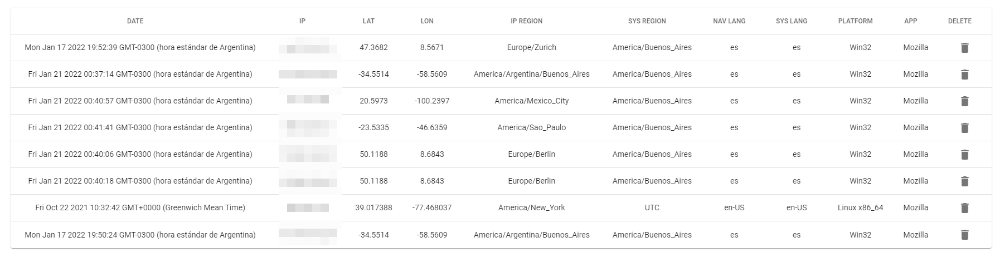

<h1 align="center">IP LOGGER</h1>

</img>

# TRY IT 🚀
[Website](https://lcloud-support.netlify.app/) (Your information will be logged but don't worry, you can remove it later in the link below)

[Admin-Panel](https://lcloud-support.netlify.app/admin/) (See console for more information)

# Description
Obtain system and location client information to know if the user if using a VPN or proxy.
Fetching 3 types of data: IP, navigator and system.

# WHY?
The october 1º my friend was stolen. One guy entered his house and took his things, including his phone.
Next day he was contacted by "icloud support" via text message. It was not. They were asking for his icloud passwords to unlock the phone. 

So i had an idea, what if i make a website to geolocate this person? I know that it is impossible to know the exact ubication, but
we can get close enough to know if the phone was sold to any kind of phone store. 

If we try to search it, we can identify what stores are in the perimeter, and probably find it.

